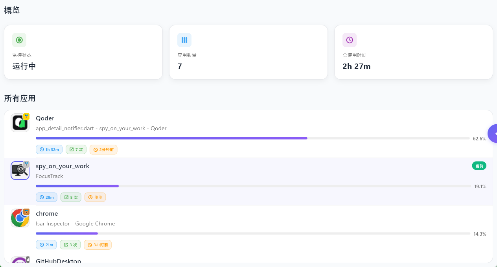
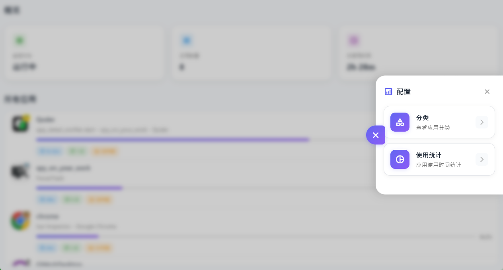
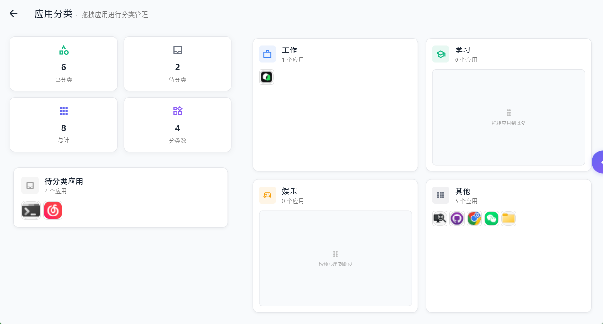
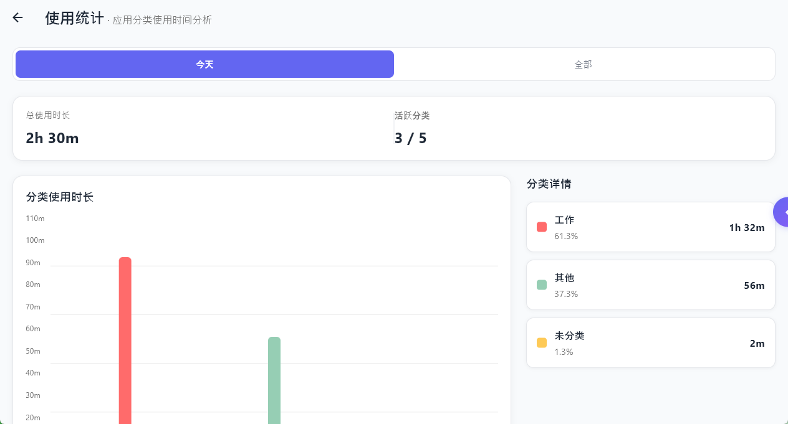
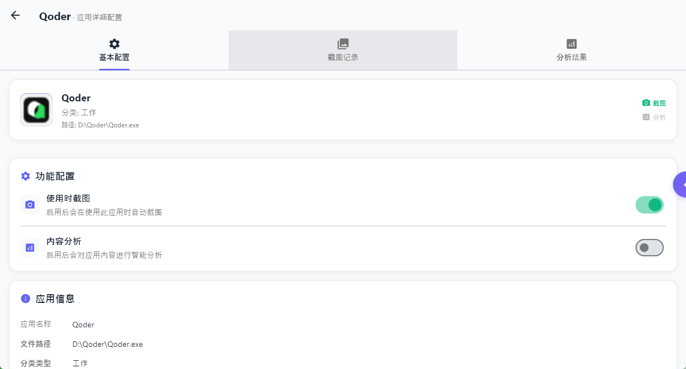
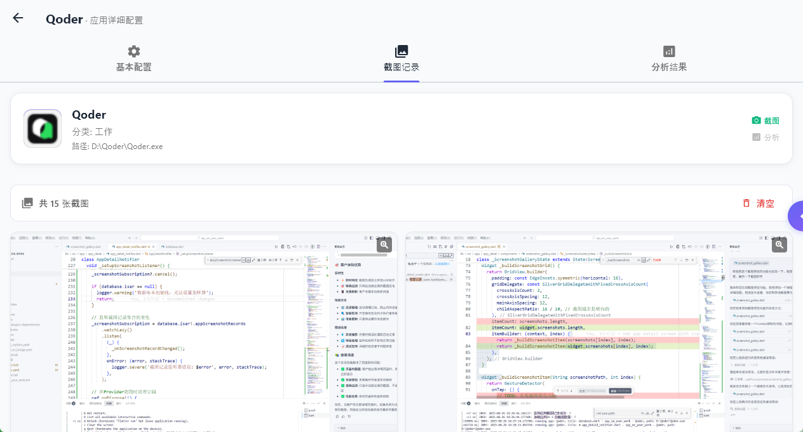

# spy_on_your_work

最近闲着，想到什么就做什么。  
这个项目是一个 **桌面应用使用时长统计工具**，顺便打算加一个 **计划管理功能**，集成到同一个应用里。

目前只支持 **Windows**，因为底层用了 `Rust + windows-rs` 来获取应用信息。其他平台暂时没适配，也不确定可不可行（主要 Windows 上娱乐多 😄）。

虽然名字叫 `spy_on_your_work`，**但完全不联网，也不会传输任何数据**，只是单纯记录你的应用使用情况而已 😳。

> 💡 小提示：这个项目里不少代码都是由 **Qoder** 生成的，搞得我下一个目标是研究智能体了。

### 一些截图

